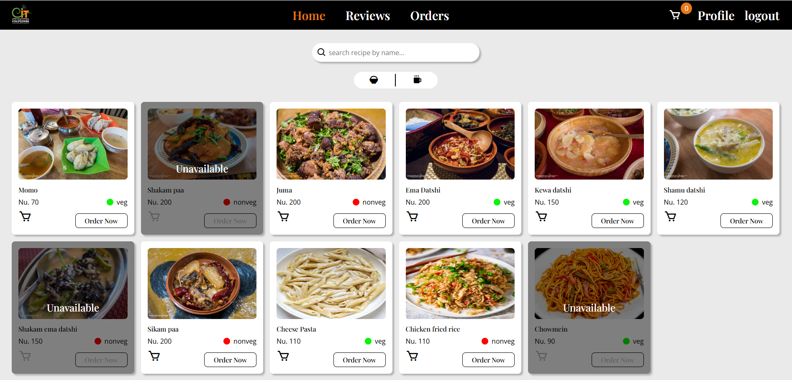

# Canteen Food Ordering System

## Overview.
The *canteen food system* project is being carried out as a part of the **computer science CSF202 module (Agile software engineering practice)**.

## Content
- [Project backgorund and aims.](#project-background-and-aims)
- [Challenges.](#challenges)
- [Learning.](#learning)
- [Project Images](#project-images)
- [Techstack](#techstack)
- [Project Setup Instructions](#project-setup-instructions)
- [Team](#team)
- [Acknowledgement](#acknowledgement)
- [Important Links](#important-links)


## Project background and aims.
This project is being carried out to address the lack of a proper ordering system in the GCIT college canteen which often leads to students having to spend long hours waiting for their orders. With this web based solution students can easily place orders and get their orders without having to wait for it and it also makes the order management process easier for the canteen.

## Challenges.
- lack of proper knowledge on system architecture was a big challenge in completing this project.
- Setting up a proper server side rendering was also challenging. We doubt that we have used ejs to it's full potential in this project. 
- Figuring out *passportjs* also posed bit of a challenge.
- Overall there were countless minor challenges we faced regarding setting up the backend and creating the user friendly views.

## Learning.
- Through this project we learned a lot about following the agile methodology for software development (it really makes collaboration more simpler during software development).
- It was also an inetresting journey figuring out server side rendering and applying it to this project.
- We also learned about session based authentication which doesn't seem to be the recommended way to authenticate users. You can read more about it in the blog article we have linked in the [important links.](#important-links)
- We also learned using the *passportjs* package which is a popular library for managing user authentication and authorization. You can read about it in the passportjs documentation we have linked in the [important links.](#important-links)   

The above mentioned once are only the few significant things we learned from working on this project. There are countless other invaluable stuff we learned by overcoming the challenges.

## Project Images





## Techstack
The project uses **server side rendering(SSR)** with the *ejs(embeded javascript)* templating language mainly for faster load time and reduce latency. We have provided a link to a blog article that dives more into SSR in the [important links.](#important-links) 
- views: ejs,CSS,JS
- Backend: Nodejs(expressjs)
- Database: MongoDB
- Project management: Asana
- version Control: git
- Design: Figma

## Project Setup Instructions
1. Copy the repository URL.
2. Clone the project to your local machine.

   ```git
   git clone https://gitlab.com/agile-csf-201/food_ordering_system.git
   ```

3. Install the project dependencies.
    ```
    npm i
    ```

4. Open the *example.env* file and enter the required details and rename the file to *.env* (this should make git ignore the file).

    ```
    PORT="ENTER THE PORT YOU WANT TO RUN THE APPLICATION ON"
    MONGO_URI="PASTE YOUR MONGO URI"
    SESSION_SECRET= "ENTER A SESSION SECRET"
    ADMIN_EMAIL= "ENTER YOUR ADMIN EMAIL"
    ```
5. Go to *user.model.js* file and uncomment:
    ```javascript
    if(this.email === 'admin@email'){
        this.role = 'admin'
    }
    ```
    You can remove this code block once you register admin.

6. open your terminal and run the command:
    ```
    npm run data:import
    ```
    This should save the food and drinks data in the *foods.js* and *drinks.js* file in the database folder to your databse.

7. Finally run the following command in your terminal:
    ```
    npm run dev
    ```
    This should run the application on your specified port in development mode.

## Team
- Scrum master.
    - Tenzin Choda(12230054.gcit@rub.edu.bt)
- Product owner.
    - Sonam Wangmo(12230047.gcit@rub.edu.bt)
- Developer.
    - Thinley Dhendup(12230057.gcit@rub.edu.bt)

## Acknowledgement
This project really helped in building us up as capable web application developers from identifying the users needs to fulfilling them in the most effective ways. So all the gratitude goes to our module tutor miss. Jamyang Choden who been guiding us through the porject with constant reviews and feedbacks. It is the result of building on those feedbacks that the project in in it's current shape.  

## Important links
- [MongoDB official website](https://www.mongodb.com/)
- [Asana official website](https://asana.com/)
- [NodeJs official website](https://nodejs.org/en)
- [Figma official website](https://www.figma.com/)
- [passportjs documentation](https://www.passportjs.org/)
- [Learn more about SSR here](https://prismic.io/blog/what-is-ssr?ref=dailydev)
- [Learn more about the difference between session based authentication and JWT authentication here.](https://dev.to/codeparrot/jwt-vs-session-authentication-1mol)
